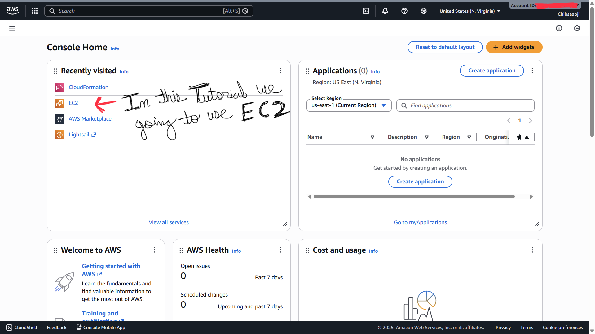
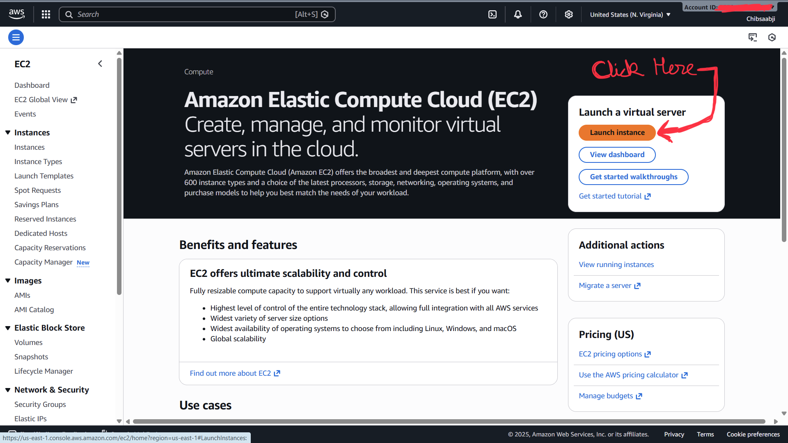
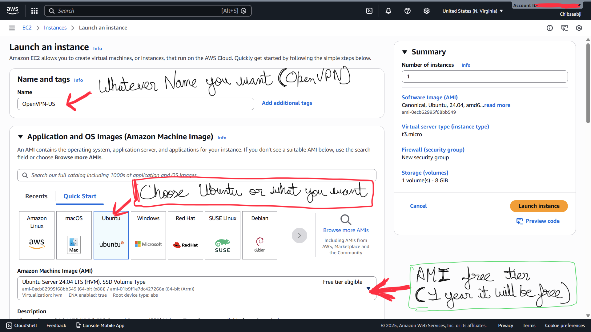
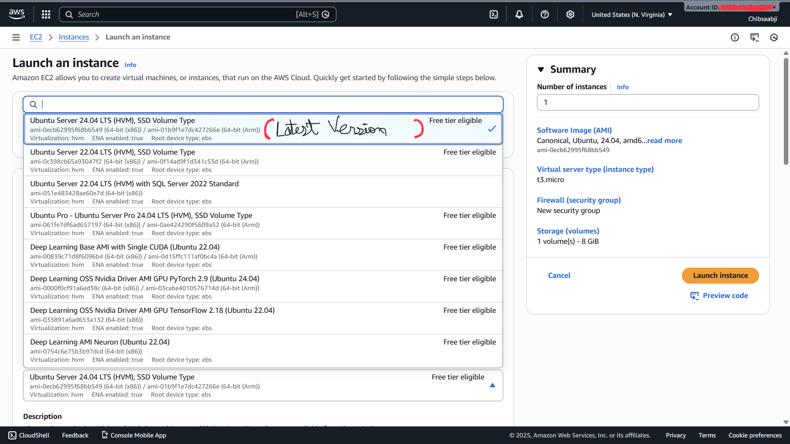
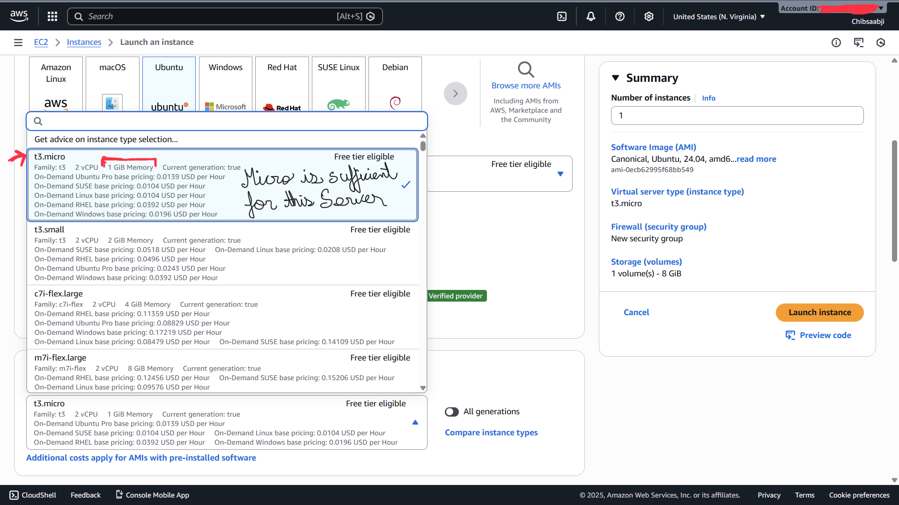
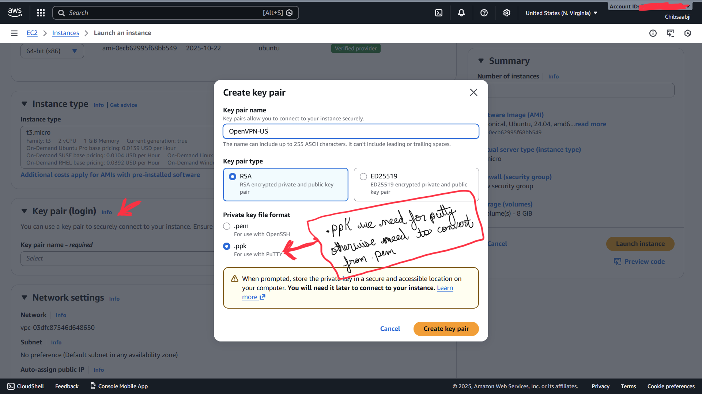
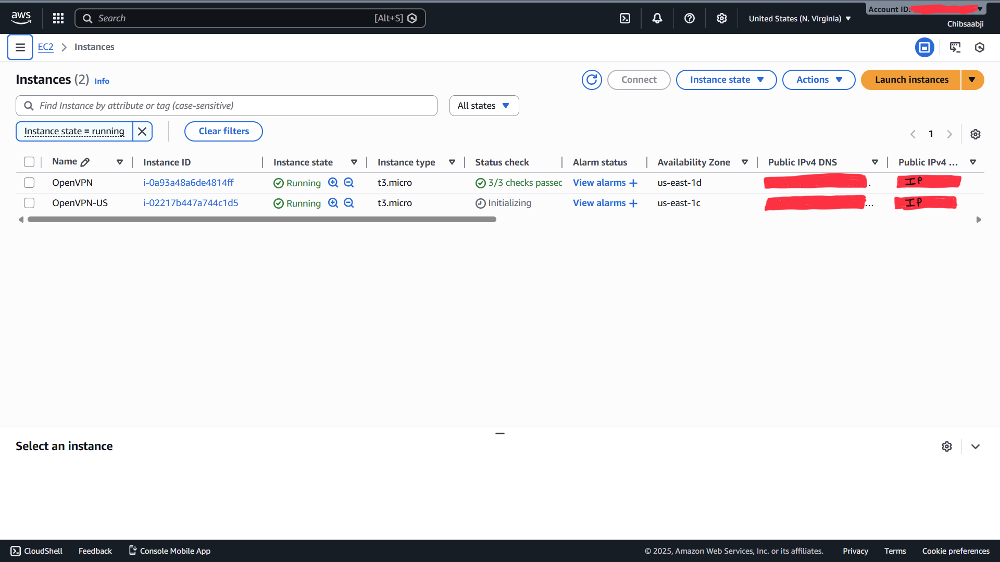
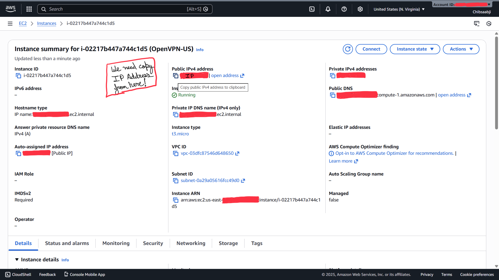

# Installation of OpvenVPN 
## AWS EC2 Setup for OpenVPN (Ubuntu 24.04)

This guide explains how to create an AWS EC2 instance named **openvpn-us**
using **Ubuntu Server 24.04 LTS**.

---
## Step 1: Login to AWS Console and Open EC2 Dashboard

---
## Step 2: Click to Open Instance

---
## Step 3: Create a Ubuntu AMI (Name whatever you want)

---
## Step 4: Select a Ubuntu 24.04 (Latest Version)

---
## Step 5: Choose t3.micro (AWS Free Tier)

---
## Step 6: Create a .ppk Key for PuTTy

---
## Step 7: Click Launch Instance

---
## Step 8: Running Instance 

---
## Step 9: Click on the Instance ID and Copy IP

