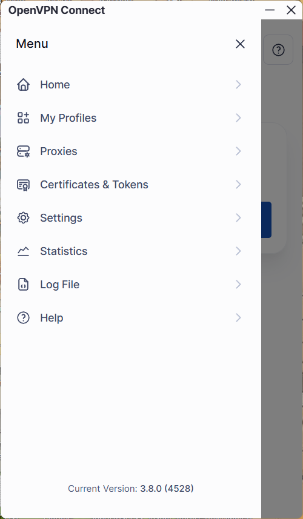
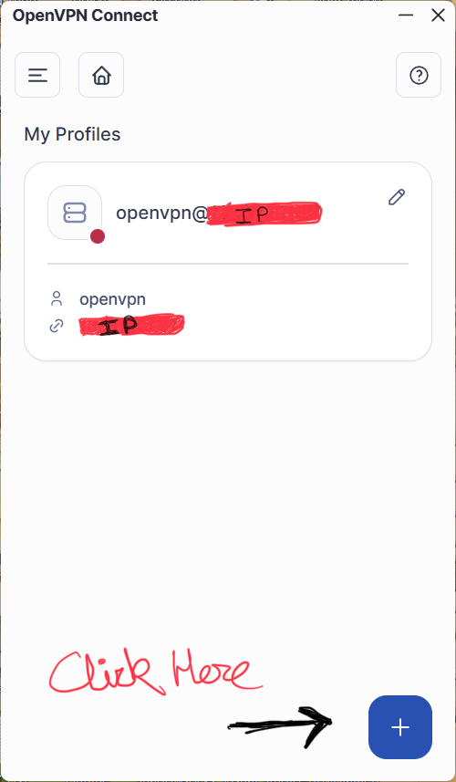
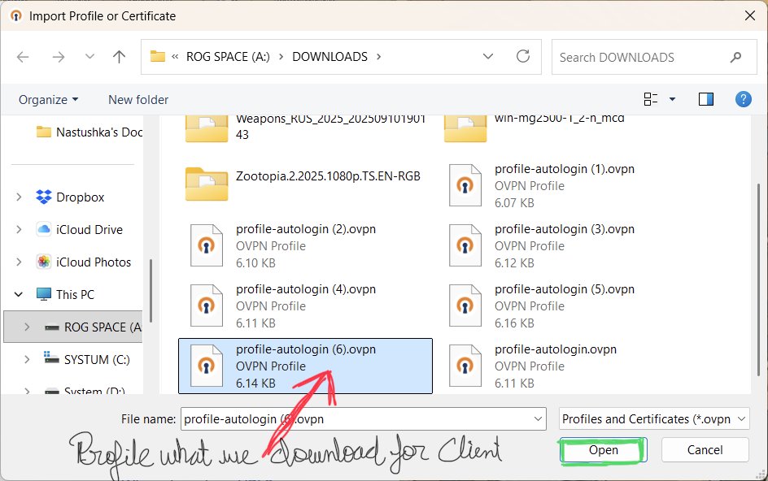
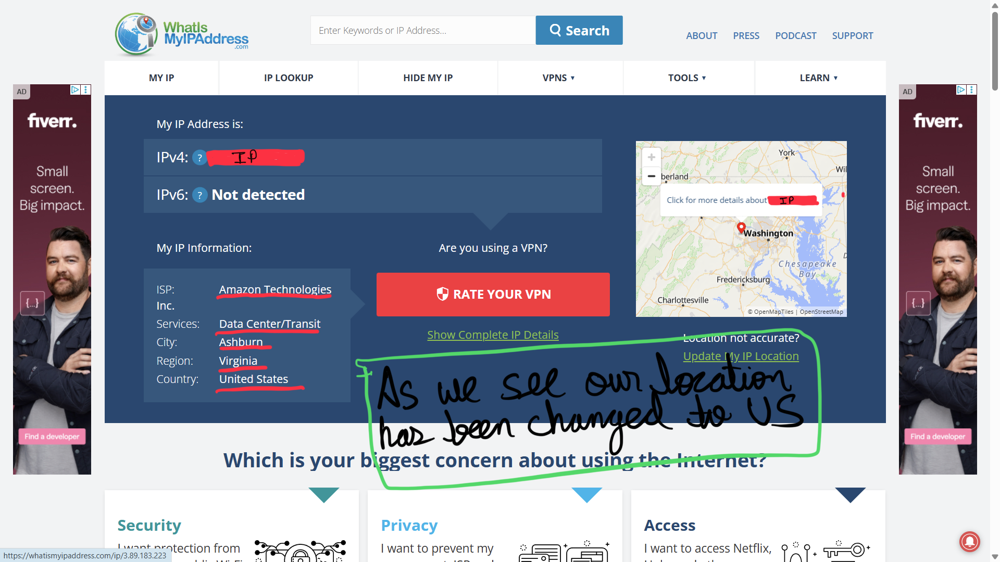

# Connect to OpenVPN Client

This guide explains how to connect **OpenVPN Client** 
https://openvpn.net/client/

---

## Step 1: Download the OpenVPN Client and Open it
Look for the Profiles

---

## Step 2: Click on the plus icon
Here we going to Upload our Profile 

---

## Step 3: Select the Donloaded Profile
OVPN Profile which I download from our Access Server 

---

## Step 4: Here the moment of Truth
We are going to Check whether or not our VPN is working.  
As we see they are showing us our Location in US (Amazon Data Center)

---
