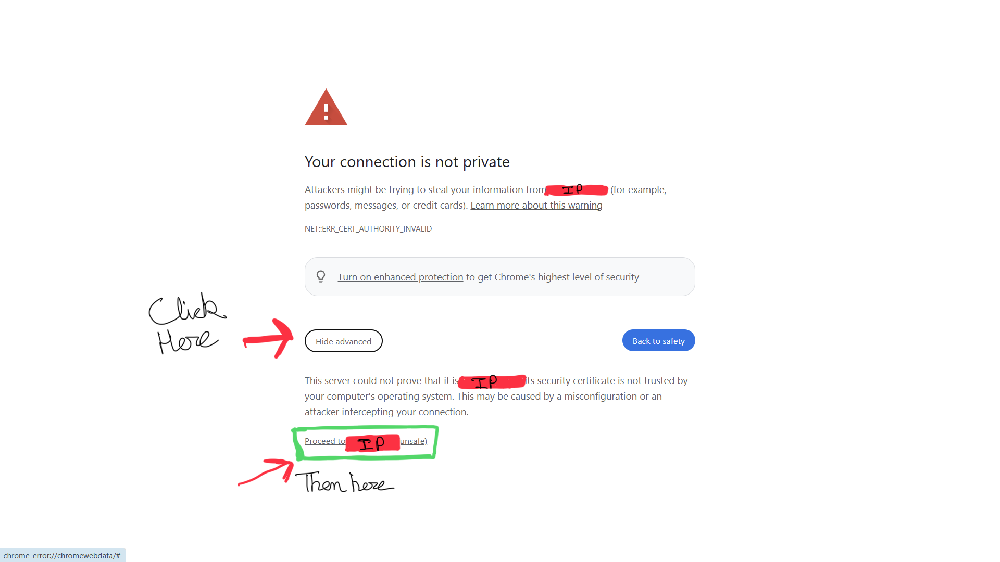
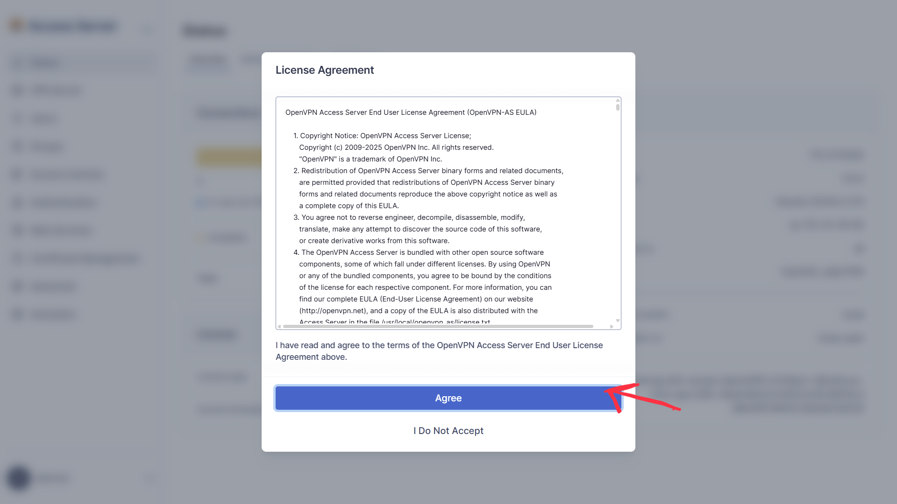
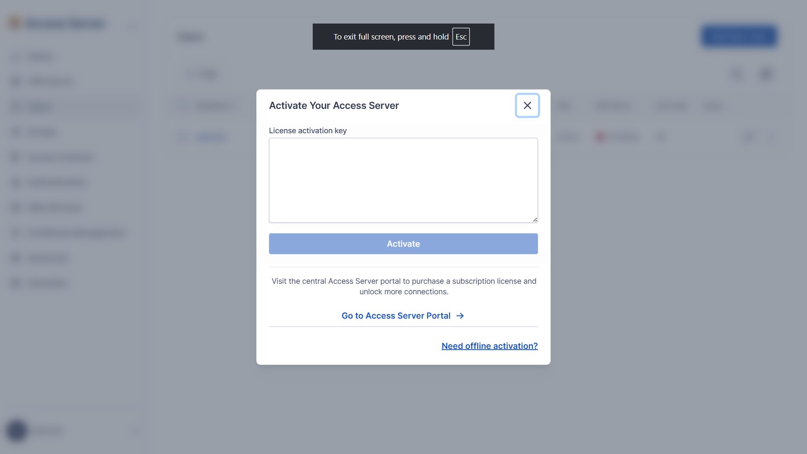
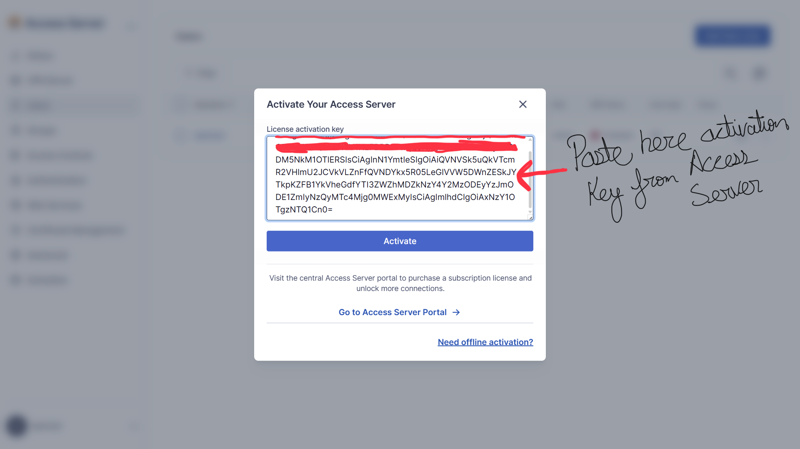
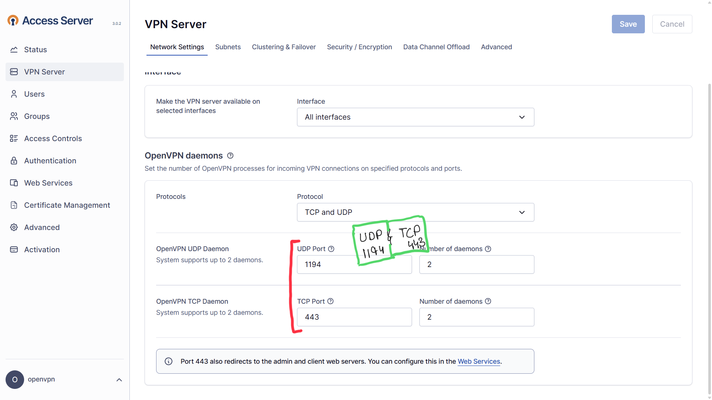
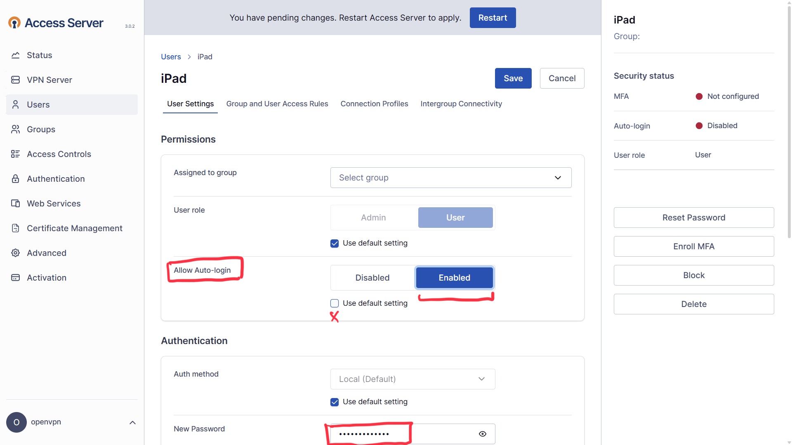
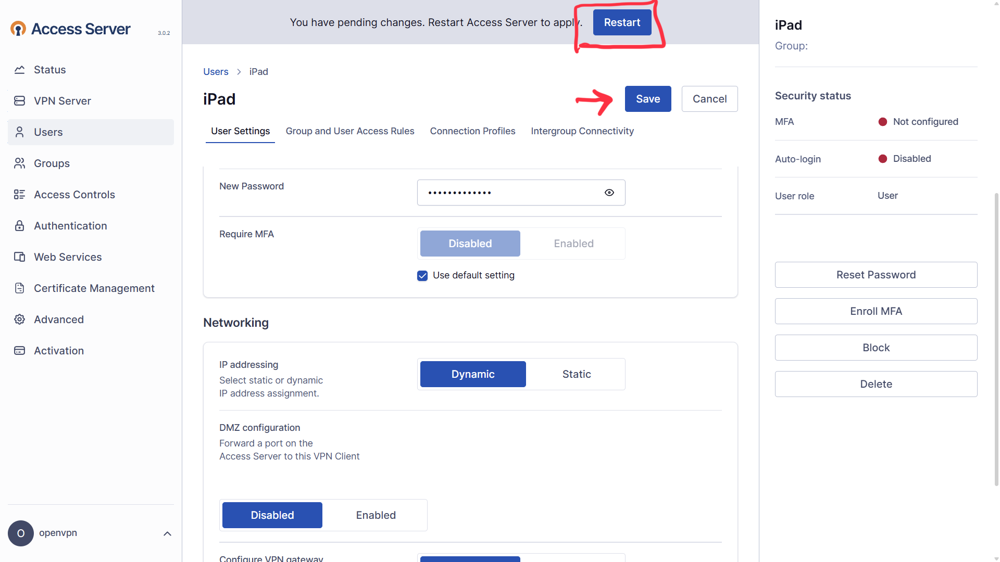
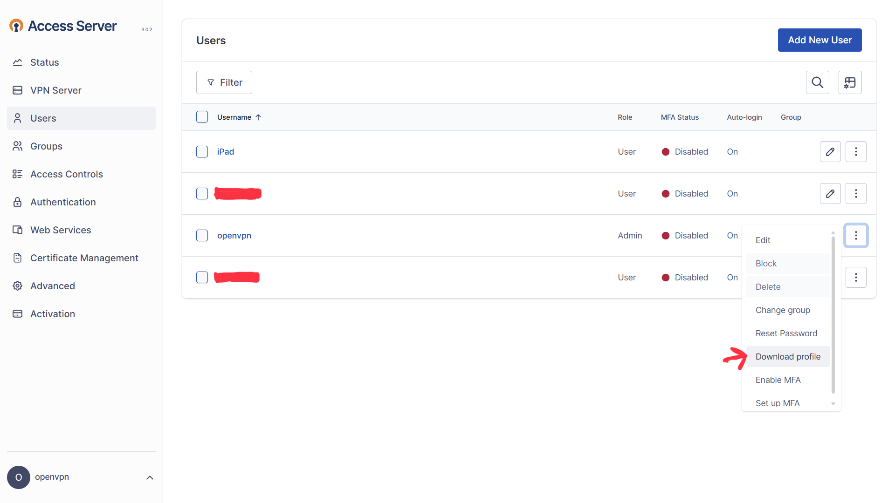
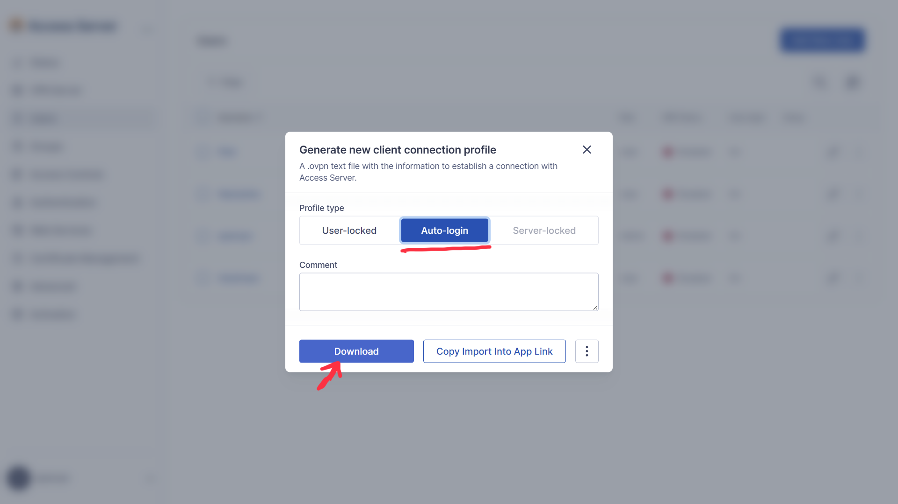

# Login to our OpenVPN Server

**This guide explains how to login to the OpenVPN Server**
---

## Step 1: Paste the `https://198.51.100.130:943/admin` in your Broswer
Click on **Advance** and **Continue** to https://198.51.100.130:943/admin

---

## Step 2: Agree the Agreement of License
Click on **Agree**

---

## Step 3: Activate the OpenVPN
Go to `https://openvpn.net` and Login to Access Server

---

## Step 4: Copy the Activation Key from Access Server
Paste the Key and Click on **Activate**

---

## Step 5: VPN Server
Check for **TCP** and **UDP** as per the Image

---

## Step 6: Creating User
For Example I am creating User iPad

---

## Step 7: Setting up User
After Changing the password **Restart the Server**

---

## Step 8: Click on Three Dot
Click on Download Profile

---

## Step 9: Download the Profile
Click on **Auto-Login** Profile

---

