# Connect to AWS EC2 Using PuTTY (OpenVPN Server)

This guide explains how to connect to the AWS EC2 instance
**openvpn-us (Ubuntu 24.04)** using **PuTTY** on Windows.  
Link: https://the.earth.li/~sgtatham/putty/latest/w64/putty-64bit-0.83-installer.msi

---

## Step 1: Open PuTTY Software in your Desktop
Paste the IP Address from your AWS

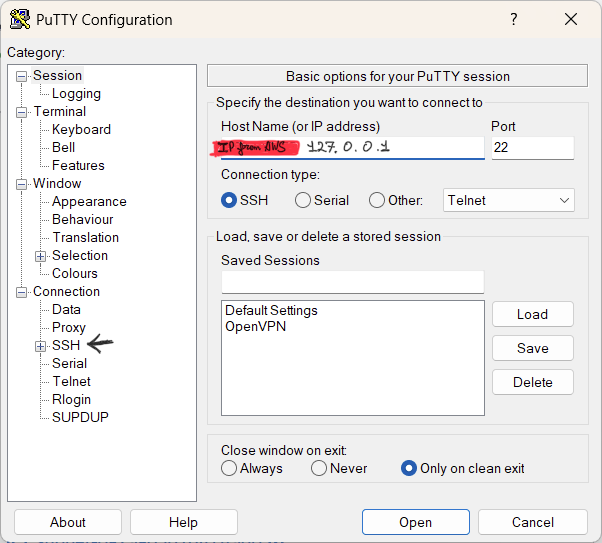

---

## Step 2: Create Session in PuTTy
Add Name of your **Session** and Click on **SSH**.

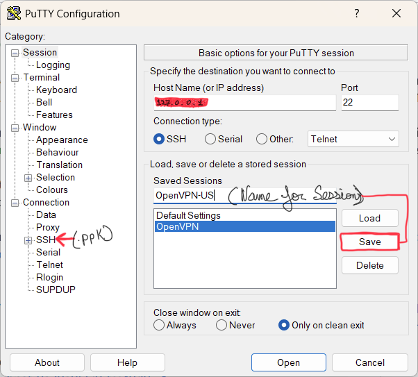

---

## Step 3: Load AWS `.ppk` Key
Click **SHH** and then **Auth** and select your AWS key file (`.ppk`).

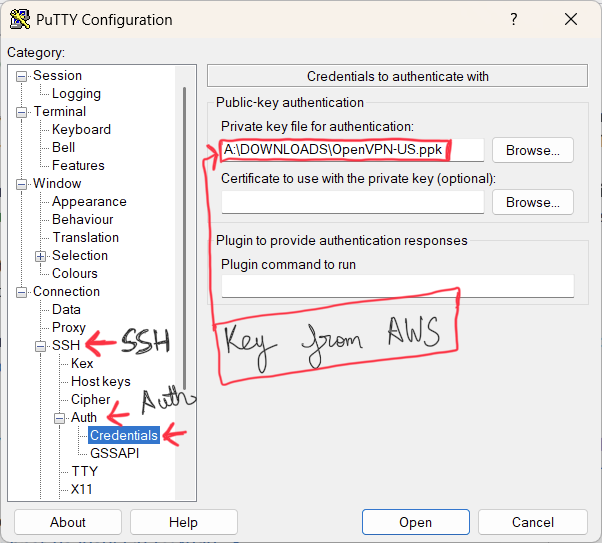

---

## Step 4: Click on Save
Click **Save** and it will save the session for us and we can open it later if we need to change something  
After this click on **Open**

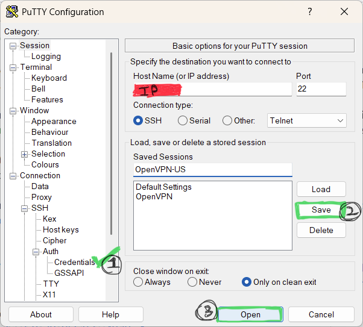

---

## Step 5: Open PuTTY Session
It will Start Connecting PuTTy to AWS  
Username: `ubuntu`

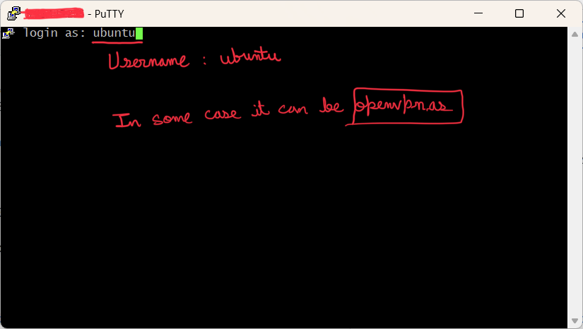

---

## Step 6: Update Ubuntu Server
We going to use Command `sudo apt update && sudo apt upgrade -y`

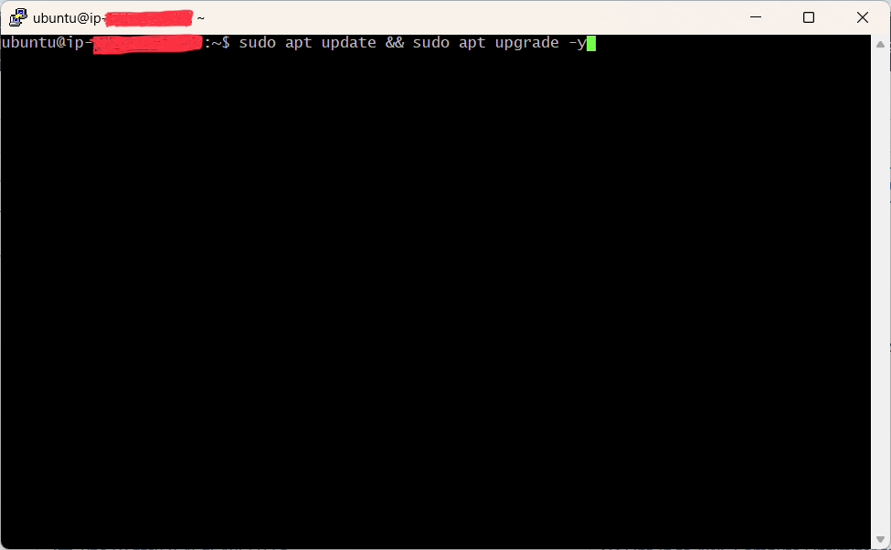

---

## Step 7: Processing
Update is ongoing in Ubuntu Server  
Command: `clean`

---

## Step 8: SuperUser
We going to use Command: `sudo su`

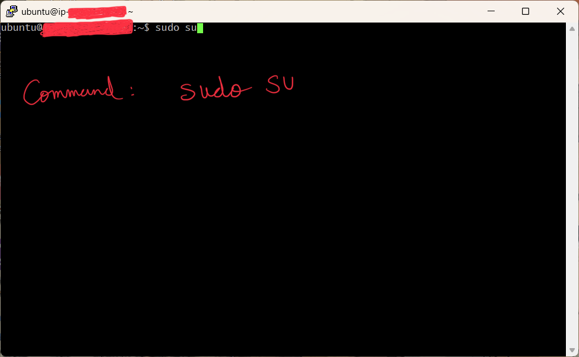

---

## Step 9: Running OpenVPN Script
Command: `bash <(curl -fsS https://packages.openvpn.net/as/install.sh) --yes`

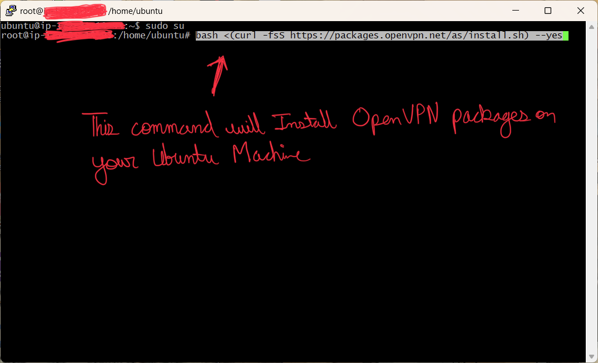

---

## Step 10: Installing OpenVPN Script
Installing OpenVPN and Installing Process going on !

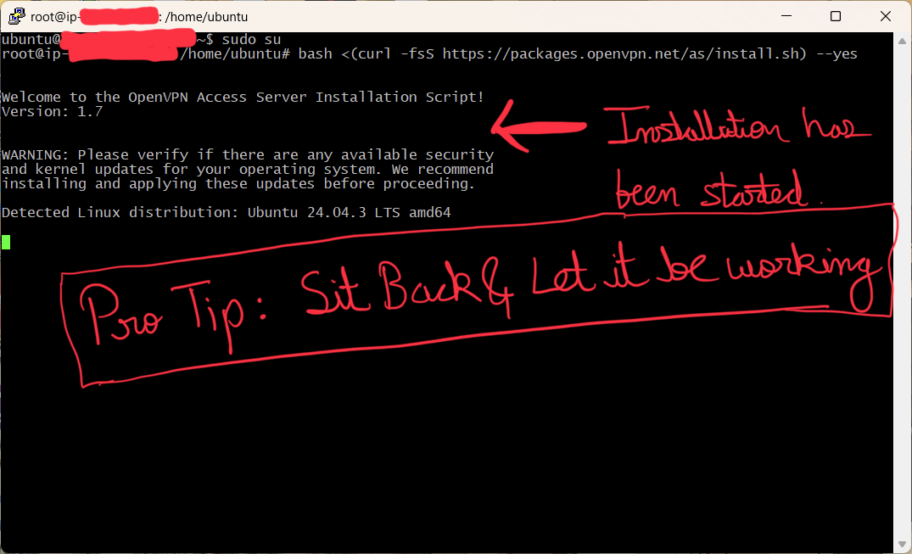

---

## Step 11: Installing OpenVPN Script
Installing OpenVPN and Installing Process going on !

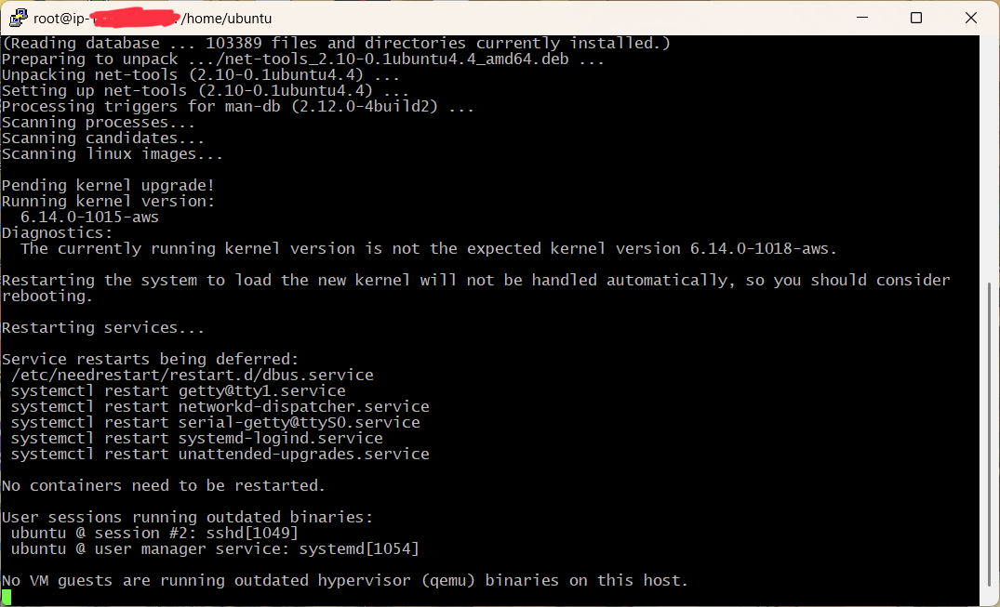

---

## Step 12: Installing OpenVPN Script
Installing OpenVPN and Installing Process going on !

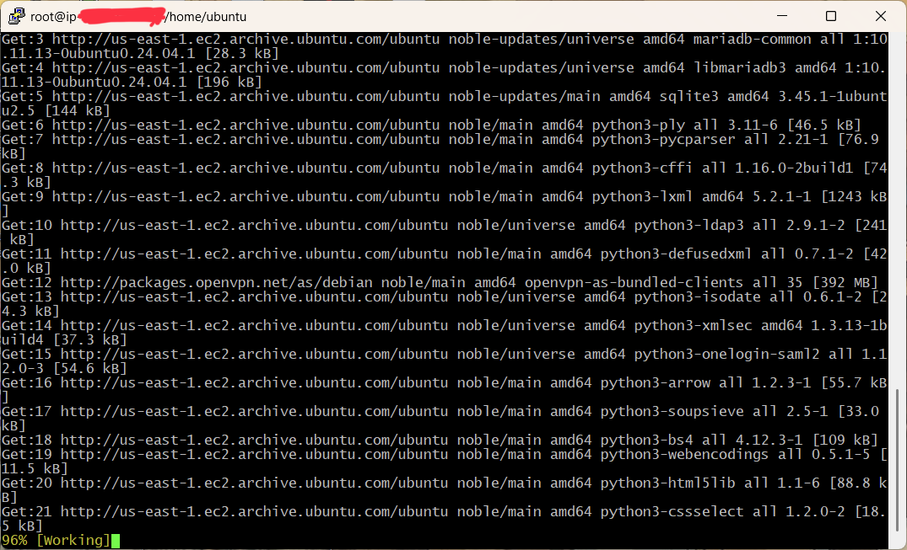

---

## Step 13: Installing OpenVPN Script
Installing OpenVPN and Installing Process going on !

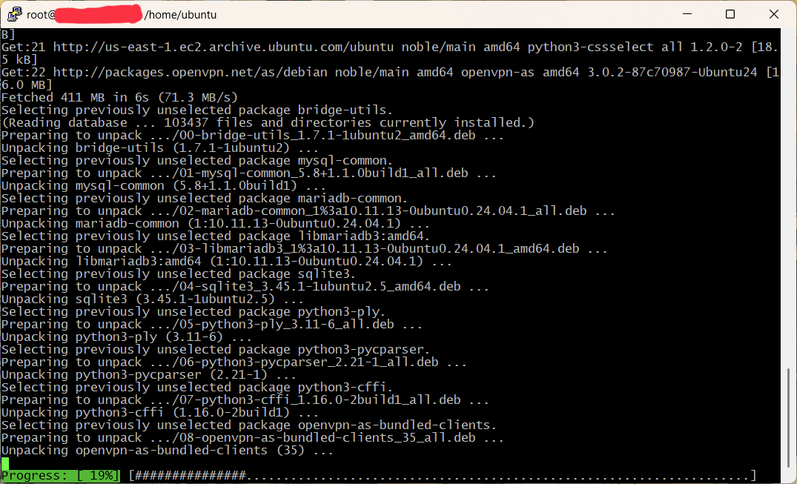

---

## Step 14: Configure Authentication Access Server 3.0.2
+++++++++++++++++++++++++++++++++++++++++++++++  
Access Server 3.0.2 has been successfully installed in /usr/local/openvpn_as  
Configuration log file has been written to /usr/local/openvpn_as/init.log  

Access Server Web UIs are available here:  
Admin UI: https://198.51.100.130:943/admin  
Client UI: https://198.51.100.130:943   
To login please use the "openvpn" account with "RR4ImyhwbFFq" password.  
(password can be changed on Admin UI)   
+++++++++++++++++++++++++++++++++++++++++++++++
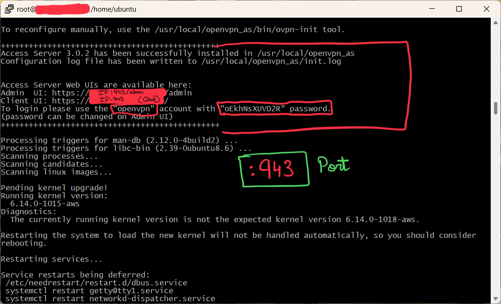

